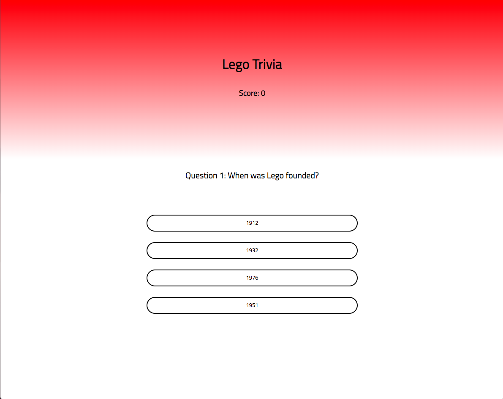

# Project1-Trivia-Game
SEIR Project 1 - a self scoring trivia game  
A trivia game about Lego that progresses through ten questions as the user chooses answers. Final score is displayed in the end.  

## Current Features
- Users can select between four answer choices
- Users can see their score as they progress through the game
- Users can see their final score once game is completed

### Technologies Used
- HTML
- CSS
- Javascript 

## Installation Instructions
To set up the game locally on your system: 

1. Fork and clone this repository
2. Copy the clone into your terminal and navigate into the directory
3. Once complete set up a live server in your browser via your text editor

### Contribute
- Source Code: (https://github.com/elafarga10/Project1-Trivia-Game)
